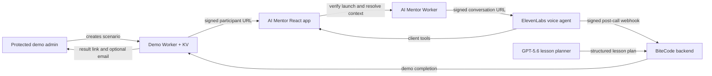

# BiteCode AI Mentor demo

BiteCode AI Mentor turns a voice conversation into a guided programming lesson. The learner speaks naturally with an ElevenLabs mentor while the BiteCode app keeps the lesson visible: it presents topics, questions, code, answer feedback, progress, and a final learning result at the moment each item is discussed.

This folder contains the protected demo scenario builder for the real AI Mentor application. It does **not** create a mock mentor. An administrator chooses the learning context, the Worker creates a signed participant URL, and that URL opens the same React app and ElevenLabs agent used by BiteCode learners.

## What the demo proves

- A voice-first lesson can remain understandable and accessible through synchronized visual cards.
- The mentor receives learning context without exposing learner details in a URL.
- Prior strengths, gaps, preferences, and practice recommendations can shape the next conversation.
- Signed, expiring demo claims and explicit tester consent isolate judging sessions from production learner records.
- The post-call webhook captures the provider result idempotently and can notify a privately configured administrator.

## System architecture



The important trust boundary is that only Workers hold signing keys and provider credentials. The browser receives a signed launch payload, never an ElevenLabs API key.

## Repository map

| Path | Purpose |
| --- | --- |
| `demo/src/` | Protected scenario form, signature verification, KV session state, completion handling |
| `demo/scripts/generate-admin-link.mjs` | Requests a short-lived administrator URL from the Worker |
| `demo/test/` | Security and Worker integration tests using in-memory KV and email doubles |
| `AImentorApp/` | React/Vite participant experience and ElevenLabs client-tool UI |
| `AImentorApp/elevenlabs-agent/` | Versioned system and workflow prompts |
| `AImentorApp/elevenlabs-tools/` | Client-tool schemas for topics, questions, code, feedback, progress, and results |
| `worker/` | Signed lesson resolution, D1 context assembly, usage control, and ElevenLabs session creation |
| `docs/` | Relationship-layer design, deployment, evaluation, and webhook examples |

## Prerequisites

- Node.js 20 or newer and npm
- A Cloudflare account with Workers, KV, D1, and Email Sending access
- Wrangler authenticated with `npx.cmd wrangler login`
- An ElevenLabs Conversational AI agent configured from `AImentorApp/elevenlabs-agent/` and `AImentorApp/elevenlabs-tools/`
- For the complete platform flow, the sibling `cloudflare-backend` project and its D1 migrations

The commands below use PowerShell. On macOS or Linux, use `npm`/`npx` instead of `npm.cmd`/`npx.cmd`.

## Quick start: test the demo Worker locally

```powershell
cd C:\BiteCode\aimentor\demo
npm.cmd install
npm.cmd test
npm.cmd run dev
```

Create `demo/.dev.vars` for local development. Use test-only values and never commit the file:

```dotenv
DEMO_URL_SIGNING_SECRET_CURRENT=replace-with-a-long-random-local-secret
DEMO_ADMIN_CLI_TOKEN=replace-with-a-local-admin-token
DEMO_COMPLETION_TOKEN=replace-with-a-local-completion-token
DEMO_ADMIN_NOTIFICATION_EMAIL=you@example.com
```

The local Worker needs a local KV namespace when exercising the browser form through Wrangler. The automated tests do not require Cloudflare resources: they supply in-memory KV and email implementations.

In a second PowerShell terminal, request an administrator URL from the local Worker:

```powershell
cd C:\BiteCode\aimentor\demo
$env:DEMO_ADMIN_CLI_TOKEN = "replace-with-a-local-admin-token"
npm.cmd run admin-link -- --url http://127.0.0.1:8787
```

Open the printed URL. It is single-use and defaults to a 15-minute lifetime.

## Run the participant app

```powershell
cd C:\BiteCode\aimentor\AImentorApp
npm.cmd install
npm.cmd test
npm.cmd run dev
```

The current app configuration points to the deployed AI Mentor Worker in `src/config/workerConfig.ts`. To run the entire stack locally, change both exported endpoint constants to the local mentor Worker, start `worker/worker.js` with Wrangler, and provide the bindings and secrets listed below. Do not commit local endpoint or secret changes.

## Required Cloudflare configuration

### Demo Worker: `bitecode-ai-mentor-demo`

Bindings are declared in `demo/wrangler.jsonc`:

- `DEMO_SESSIONS`: KV namespace for admin links, browser sessions, scenarios, consent, and results
- `EMAIL`: optional Cloudflare email binding for completion notification

Set these secrets with `npx.cmd wrangler secret put <NAME>`:

```text
DEMO_URL_SIGNING_SECRET_CURRENT
DEMO_ADMIN_CLI_TOKEN
DEMO_COMPLETION_TOKEN
DEMO_ADMIN_NOTIFICATION_EMAIL
```

`DEMO_URL_SIGNING_SECRET_PREVIOUS` is optional during key rotation.

### AI Mentor Worker: `bitecode-aimentor-worker`

- `DB`: BiteCode site D1 binding
- `DEMO_ADMIN`: service binding to `bitecode-ai-mentor-demo`
- `HMAC_SECRET`: verifies normal BiteCode lesson links
- `ELEVENLABS_AGENT_ID`: existing Conversational AI agent ID
- `ELEVENLABS_API_KEY`: server-side key used to request an ElevenLabs signed conversation URL

### Backend orchestrator

The development and production backend Workers require:

```text
ELEVENLABS_WEBHOOK_SECRET
DEMO_COMPLETION_TOKEN
```

`DEMO_COMPLETION_TOKEN` must match on the demo Worker and backend orchestrator. Configure ElevenLabs to send its signed post-call webhook to:

```text
POST /internal/mentor-sessions/elevenlabs/completed
```

Never place any of these values in the React app, a participant URL, sample data, or source control.

## Sample data

No production user, subscription, course, or lesson row is required for demo mode. `demo/src/defaultScenario.js` contains safe editable sample data and the scenario is stored in `DEMO_SESSIONS` KV.

The supplied scenario uses:

- learner: Alex, beginner
- course: JavaScript Foundations
- lesson: Functions and parameters
- lesson goal: understand parameters and return values
- prior memory: variables, expressions, and built-in function calls
- learning gaps: parameters versus arguments, and the meaning of `return`
- preferences: plain language, short examples, and frequent comprehension checks

Administrators can replace every field before generating the participant URL. JSON fields such as learning memory, strengths, gaps, and practice recommendations must contain valid JSON arrays. Do not enter real personal data for judging.

## Generate a deployed demo URL

```powershell
cd C:\BiteCode\aimentor\demo
$env:DEMO_ADMIN_CLI_TOKEN = "<the configured CLI token>"
npm.cmd run admin-link
```

Then:

1. Open the one-time administrator URL.
2. Review or edit the sample scenario and accept the administrator consent.
3. Generate the signed participant URL.
4. Open it in a clean browser tab, accept the tester explanation, and allow microphone access.
5. Complete the voice lesson and open the administrator result URL.

Participant URLs default to a 90-day lifetime so a submitted judging link remains usable. Administrator result links default to 24 hours. Both values are configurable in `demo/wrangler.jsonc`.

## How to test

### 1. Automated checks

```powershell
cd C:\BiteCode\aimentor\demo
npm.cmd test
npx.cmd wrangler deploy --dry-run

cd ..\AImentorApp
npm.cmd test
npm.cmd run build

cd ..\worker
node --test relationshipLayer.test.js
```

The demo tests verify blocked direct administration, single-use admin links, secure cookies, signed scenario claims, tamper rejection, explicit consent, idempotent completion, and one-time email delivery.

### 2. Happy-path judging test

During a live session, confirm that:

- the app explains demo data use before the microphone or ElevenLabs session starts;
- the mentor greets the learner and uses the configured lesson goal and prior context;
- visual topics do not flicker back after a question or code example replaces them;
- questions appear when the mentor introduces them, not before;
- code is formatted in the presentation area;
- correct, not-quite, and wrong answers show distinct feedback and sounds;
- the header reports the current topic naturally while preserving timer and audio controls;
- the final result appears in the content area and the mentor says a farewell before disconnecting;
- the signed result link shows provider status, duration, summary, sentiment, and transcript when supplied by ElevenLabs.

### 3. Security and failure tests

- Reopen the admin URL: it must not create a second browser session.
- Change one character in `data` or `sig`: launch verification must fail.
- Call the completion endpoint without the bearer token: it must return `404`.
- Replay the same completion: it must return `duplicate` and send no second email.
- Remove microphone permission: the app must show a useful error without leaking credentials.
- End a call early: the result must preserve the provider termination reason.

### 4. Production-data path (maintainers)

Normal BiteCode lesson links contain only signed IDs. The AI Mentor Worker resolves user, subscription, course, lesson, learning goal, progress, preferences, history, gaps, and practice recommendations from D1. After a verified post-call webhook, the backend persists normalized results and schedules analysis. Demo mode intentionally bypasses product user, subscription, daily-usage, learning-history, and notification-history writes.

## How GPT-5.6 is integrated

GPT-5.6 is the structured lesson-planning model in the BiteCode backend. The sibling `cloudflare-backend` project assembles the learner goal, course context, completed lessons, and repetition-avoidance instructions, then asks the model for JSON containing the course name and ordered mini-lessons. The provider supports Cloudflare's AI binding/AI Gateway or a direct OpenAI-compatible endpoint. Model routing is configuration-driven; the OpenAI route defaults to `gpt-5.6-sol` in `src/providers/ai/lessonPlanProvider.ts` and can be selected explicitly with `LESSON_PLANNER_MODEL`/`OPENAI_MODEL`.

That generated plan becomes input to BiteCode's lesson and mentor context. The demo's default scenario is deliberately fixed rather than regenerated at launch, which makes every judge's starting conditions reproducible. ElevenLabs remains the low-latency voice conversation runtime; GPT-5.6 handles the deeper structured planning task. Post-call analysis is separately model-routed, so its model can evolve without changing the signed demo or voice UX.

## How Codex accelerated the workflow

Codex with GPT-5.6 acted as an engineering copilot across the repository rather than as a one-shot code generator. It accelerated the work by:

- tracing the end-to-end contract across React, Cloudflare Workers, D1, ElevenLabs tools, prompts, webhook ingestion, and result persistence;
- turning repeated live-session observations into small testable UI and prompt changes;
- creating and checking security tests for HMAC claims, expiration, replay protection, consent, and idempotency;
- keeping system prompts, workflow prompts, and client-tool JSON versioned beside the application;
- running builds, unit tests, Wrangler dry runs, and endpoint smoke checks after implementation slices;
- helping compare provider payloads and audit records while debugging missing transcript and sentiment fields.

The team retained the key product and safety decisions: what data may enter a URL, when the microphone is muted, when a question becomes visible, which records demo mode may write, how long links live, and when AI output is trusted. Codex shortened the feedback loop; it did not replace human review or live conversation testing.

## Key design decisions

1. **Use the real mentor, not a scripted replica.** Judges exercise the production interaction model through isolated signed demo claims.
2. **Keep URLs opaque and signed.** Normal links carry IDs; the Worker resolves rich context. Demo links carry a bounded scenario protected by HMAC, expiry, nonce, and action/route binding.
3. **Separate voice latency from deep analysis.** The live call stays responsive while post-call work is authenticated, queued, replay-safe, and independently model-routed.
4. **Make voice content visible at the right moment.** ElevenLabs client tools drive presentation cards, but the app guards timing and phase transitions to prevent premature questions and UI flicker.
5. **Preserve learner continuity.** Learning history, analysis, suggestions, course progress, and relationship checkpoints feed later sessions instead of treating every call as a blank slate.
6. **Isolate judging data.** Demo mode records consent and demo results in KV while bypassing normal learner usage and learning-history writes.
7. **Fail safely.** Provider credentials remain server-side, callbacks are verified, completion is idempotent, and feature flags can return relationship routing to the normal lesson path.

## Deployment

```powershell
cd C:\BiteCode\aimentor\demo
npm.cmd test
npx.cmd wrangler deploy --dry-run
npm.cmd run deploy
```

Deploy the participant app and AI Mentor Worker separately when their code changes. A complete release check must verify the Pages bundle, Mentor Worker bindings/secrets, demo service binding, backend webhook secret, and a real end-to-end conversation—not only a successful deploy command.
